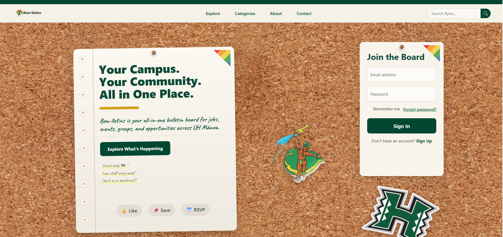

## Project Overview

Bow-lletins is a web application my team developed for our software engineering class. The purpose of the project is to create a digital bulletin board for UH Mānoa students. Instead of students having to search through scattered flyers, emails, group chats, and social media posts, Bow-lletins gives them one organized place to discover campus opportunities.

The application allows users to browse flyers for jobs, internships, events, study groups, clubs, and social activities. Users can also view flyer details, save flyers, RSVP to events, and use dashboard features after logging in. The goal of the project was to make campus information easier to find while keeping the design simple, useful, and student friendly.

## My Contributions

For this project, I worked on both the design and functionality of the application. I helped build user interface features, improve page layouts, and create a more polished experience for users. I also worked on dashboard updates, flyer display cards, category visuals, and navigation improvements.

Some of my main contributions included:

<ul>
  <li>Designing and improving the user dashboard layout</li>
  <li>Updating flyer cards and category based visuals</li>
  <li>Helping create a clean corkboard and sticky note style design</li>
  <li>Working on page navigation and user experience improvements</li>
  <li>Helping implement flyer features such as saved flyers, user flyers, and dashboard sections</li>
  <li>Testing pages and fixing layout issues during development</li>
  <li>Collaborating with teammates through GitHub issues, branches, and project boards</li>
</ul>

## What I Learned

This project helped me understand what it is like to build a larger software project with a team. I learned how important planning, communication, and version control are when multiple people are working on the same codebase. I also gained more experience with React, Next.js, Bootstrap, Prisma, PostgreSQL, and GitHub workflows.

One of the biggest things I learned was how much user experience matters. Small design choices, such as spacing, colors, navigation, and button placement, can make an application feel much easier to use. I also learned how to troubleshoot bugs, handle merge conflicts, and improve features based on feedback.

Overall, Bow-lletins gave me real experience working on a full stack web application from idea to deployment.

## Screenshots

## Project Links

You can view the organization GitHub page and source code here:

<a href="https://github.com/bowlletins/Bowlletins" target="_blank">Bow-lletins GitHub Repository</a>
