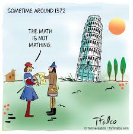
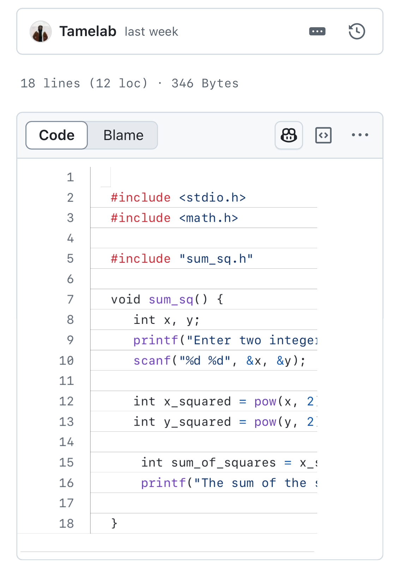

SproutSpace: AI Powered Plant Health Diagnostics
SproutSpace is an intuitive mobile application that helps home gardeners diagnose plant health issues using AI powered multispectral imaging. Whether you’re nurturing houseplants or managing a backyard garden, SproutSpace provides personalized, science backed recommendations to help your plants thrive.
---

The sum_sq() function is designed to compute the sum of the squares of two user-provided integers efficiently. It begins by prompting the user for input and then calculates the square of each integer before summing the results. Initially, the implementation uses the pow() function from <math.h> to perform exponentiation, but this approach introduces unnecessary floating-point calculations, which can lead to inefficiencies. The function is structured as follows:

While functionally correct, this implementation can be optimized. The use of pow(x, 2) is redundant when working with integers, as exponentiation in floating-point arithmetic is unnecessary for simple squaring operations. Instead, replacing pow(x, 2) with x * x significantly improves efficiency by eliminating floating-point operations and maintaining integer precision. 
 
Source: <a href="https://github.com/theVacay/vacay">theVacay/vacay</a
