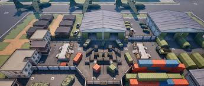

Army building for wargaming is the process of selecting and assembling a force to use in a tabletop wargame. 

<pre>
In this project, I designed an algorithm to build an optimized army for wargaming, given a set of unit codices and a limited number of points to allocate. To tackle this problem efficiently, I used a combination of dynamic programming and a greedy algorithm. The dynamic programming approach allowed me to systematically evaluate unit combinations while adhering to constraints such as point cost and unit availability. I implemented a 2D array where each row represented a unit and each column represented a point limit, enabling me to compute the most effective army configuration with a time complexity of
O(nP). By prioritizing units based on their attributes like speed, armor, and combat effectiveness, I ensured that my army selection was both balanced and cost-efficient.

To make my army adaptable to different battlefield conditions, I incorporated a greedy algorithm that adjusted unit selection based on terrain and enemy composition. This allowed me to make quick, locally optimal decisions, such as favoring long-range units for open battlefields or armored units for dense terrain. While greedy algorithms don’t always guarantee a globally optimal solution, they provided a fast and effective way to fine-tune my army for specific scenarios. By combining both dynamic and greedy approaches, I created an adaptable force that could handle a variety of strategic challenges.

To evaluate the performance of my army, I developed two simulation functions: Battle(Army A, Army B, Battlefield F) and Combat(Unit A, Unit B, Distance). The Battle() function simulated full-scale battles in 
O(n) time, allowing me to test my army’s effectiveness across different battlefield conditions. The Combat() function, which ran in O(1)time, enabled me to compared individual unit matchups and assess their performance in direct engagements. By iterating through these simulations, I identified weaknesses in my army composition and refined my selections accordingly. This process allowed me to create an optimized and highly adaptable army capable of performing well in a variety of wargaming scenarios.
</pre>

Source: <a href="https://github.com/jogarces/ics-313-text-game"><i class="large github icon "></i>jogarces/ics-313-text-game</a>
